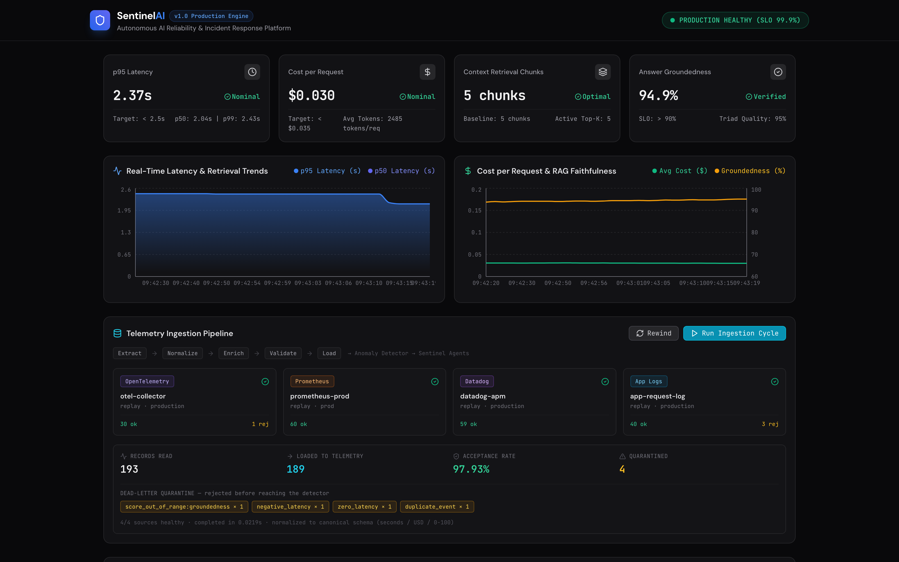
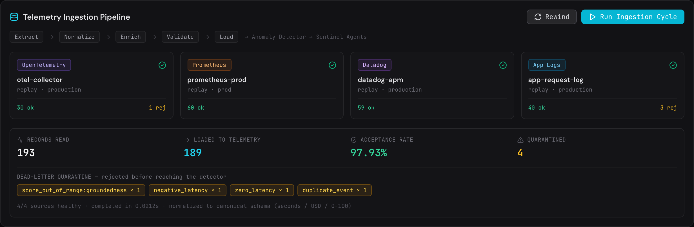
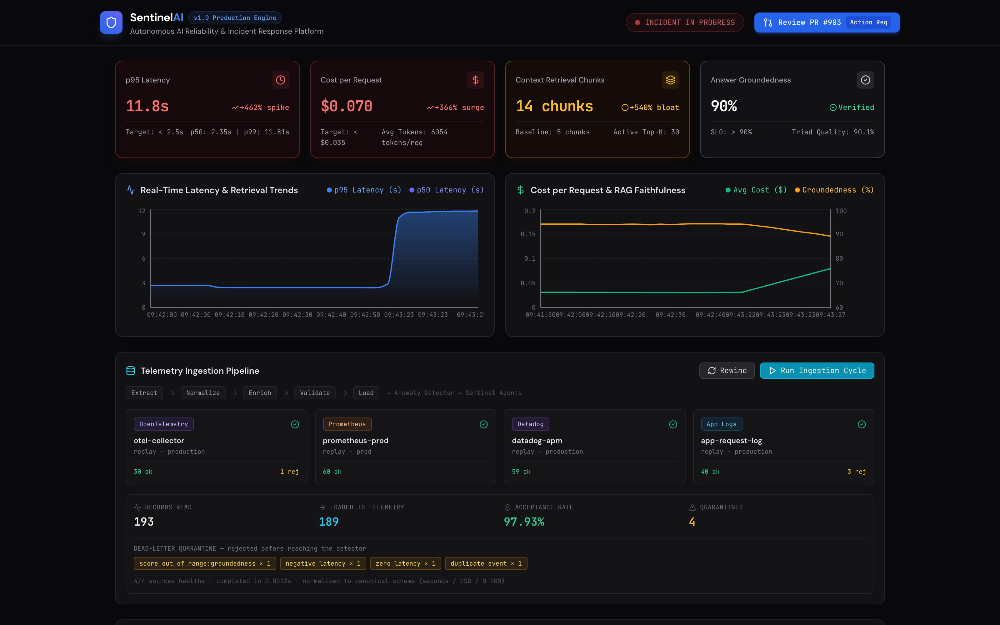
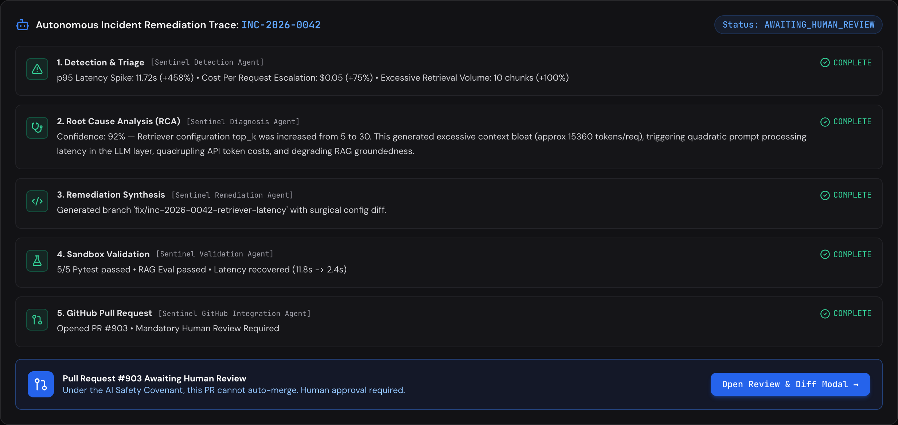
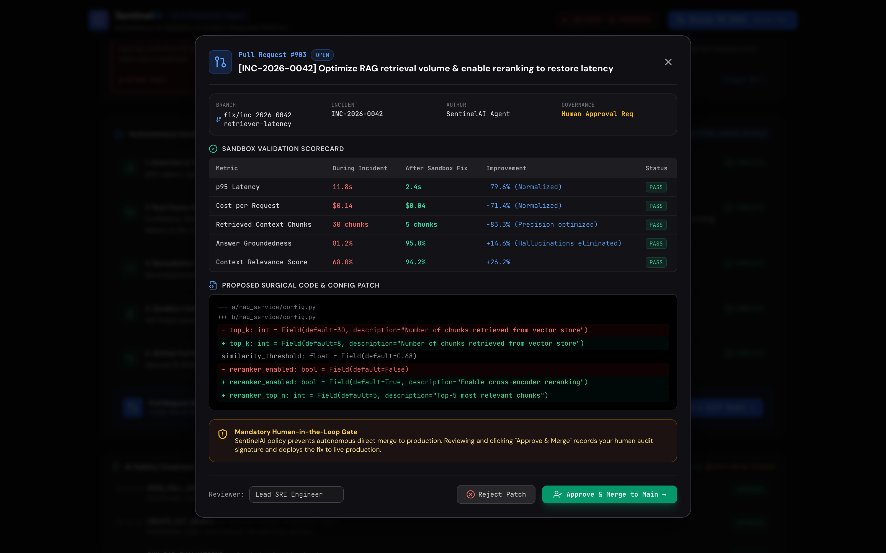
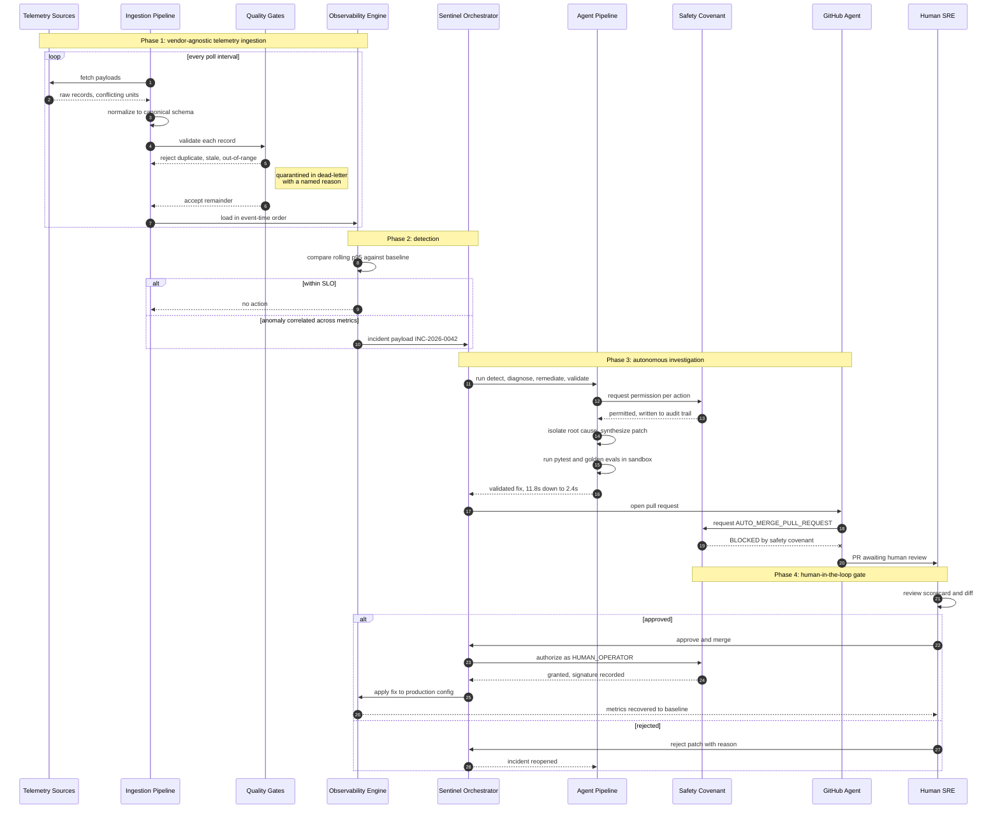

# SentinelAI: Autonomous AI Reliability & Incident Response Platform
### *Continuous Telemetry • Autonomous Root-Cause Analysis • Sandboxed Remediation • Human-in-the-Loop PR Governance*

[](tests/)
[](api/server.py)
[](dashboard/)
[](sentinel_core/safety_policy.py)

**SentinelAI** is an autonomous reliability platform for production AI systems — RAG pipelines and agentic workflows. It watches latency, cost, retrieval volume, and answer quality; when something regresses, it diagnoses the cause, writes and benchmarks a fix, and opens a pull request for a human to approve.

---

## Why This Exists

Production AI systems fail in a way ordinary services don't: **they stay up while they break.**

A conventional service tells you when something is wrong. It throws, it returns a 500, a health check goes red, someone gets paged. A RAG pipeline with a misconfigured retriever does none of that. It returns HTTP 200 on every request. The answers come back well-formed and plausible. It simply costs roughly 5x more per query, responds 5x slower, and grounds those answers in diluted context that makes them likelier to be subtly wrong. To an uptime monitor, the service looks perfectly healthy.

That leaves three gaps standard observability doesn't close:

**1. The signal is a correlated shift, not an error.**
No single metric means much on its own — latency drifting up could be load, cost drifting up could be traffic mix. But latency *and* cost *and* retrieval volume rising together while groundedness falls is a specific, diagnosable failure. You only see it if you're watching them jointly, which means getting all four onto one timeline first — usually from different vendors, in different units.

**2. A one-line config change has an enormous blast radius.**
Raising retrieval `top_k` from 5 to 30 requires no code deploy and no review, and looks like a perfectly reasonable attempt to improve recall. In the incident this repo reproduces end to end, it drives p95 latency from **2.1s to 11.8s** and per-request cost from **$0.03 to $0.14** — a 366% budget overrun, with no exception and no stack trace pointing at the cause.

**3. Detection is fast; diagnosis is slow.**
Noticing that p95 moved takes seconds. Connecting "p95 moved" to "someone changed a retrieval parameter," then writing the fix, then *proving* the fix works without regressing answer quality — that's the part that burns hours of senior engineer time, usually at 2am.

### What it does about it

SentinelAI closes the gap between detection and a reviewable fix. By the time an engineer opens the incident, the correlation across metrics is done, the root cause is identified with supporting evidence, a patch is written, and it has already been benchmarked in a sandbox against both the incident metrics and a golden evaluation set.

What's left for the human is the judgment call — which is the only part that actually needed a human.

### Why it stops short of deploying

The agents can detect, investigate, patch, test, and open a pull request. They are **structurally prevented** from merging it, pushing to a protected branch, or overriding a failed test — not by convention, but by a policy enforcer that raises on the attempt and writes the refusal to an audit trail.

This is the deliberate design position of the project. An agent that can autonomously deploy to production converts a latency incident into an outage. Keeping a human on the merge means the system's worst failure mode is a bad pull request that someone declines — which is a normal Tuesday, not an incident.

---

## Mission Control

**Steady state** — live telemetry across four ingested sources, with the platform inside its latency and cost SLOs.



**Telemetry ingestion** — OpenTelemetry, Prometheus, Datadog, and application logs normalized onto one canonical schema, with malformed records quarantined before they can skew the baseline.



**Incident detected** — `top_k` drift pushes p95 latency to 11.8s (+462%) and cost to $0.14/request. The platform opens an incident automatically; nothing errored.



**Autonomous investigation** — five specialist agents run detection, root-cause analysis, remediation synthesis, sandbox validation, and PR creation.



**Human-in-the-loop review** — the agent proposes; a human decides. The validation scorecard and diff are presented for approval, and the AI cannot merge on its own.



---

## How the Loop Is Built

Six components turn "a metric moved" into "a reviewed pull request":

1. **Vendor-Agnostic Telemetry Ingestion** — Connects to OpenTelemetry collectors, Prometheus, Datadog, and raw application logs; reconciles their conflicting units and schemas into one canonical record, and quarantines malformed data before it can corrupt the baseline. *Solves gap #1: getting every metric onto one timeline.*
2. **Continuous Observability** — p50/p95/p99 latency, per-request token cost, context chunk volume, agent tool spans, and RAG Triad scores (Groundedness, Context Relevance, Answer Quality) tracked on a rolling window.
3. **Multi-Metric Anomaly Detection** — Correlates simultaneous movement across latency, cost, retrieval volume, and quality against a healthy baseline, rather than alerting on any one of them in isolation.
4. **Autonomous Multi-Agent Investigation** — Specialist agents for detection and triage, root-cause analysis, remediation synthesis, and sandbox validation. *Solves gap #3: the slow part.*
5. **Sandbox Benchmarking** — Runs `pytest` and a golden evaluation set against the proposed patch, comparing before/after on the exact metrics that triggered the incident. A fix that regresses answer quality fails here, not in production.
6. **Human-Gated Pull Requests** — Generates the branch, commit, and a Markdown PR body carrying the RCA, the diff, and the validation scorecard — then stops and waits for a person. *Solves gap #2: a config change that bypassed review comes back through it.*

---

## Architecture

```text
        AGENTIC AI APPLICATION / RAG SERVICE (production traffic)
                                       │
        ┌──────────────┬───────────────┼───────────────┬──────────────┐
        ▼              ▼               ▼               ▼              │
   OpenTelemetry   Prometheus       Datadog        App JSONL          │
     (spans)       (series)         (series)         (logs)           │
        └──────────────┴───────────────┼───────────────┘              │
                                       ▼                              │
                     ┌─────────────────────────────────┐              │
                     │   TELEMETRY INGESTION PIPELINE   │             │
                     │  Extract → Normalize → Enrich →  │             │
                     │      Validate → Load             │             │
                     │  (unit reconciliation, dedup,    │             │
                     │   dead-letter quarantine)        │             │
                     └────────────────┬─────────────────┘             │
                                      │  canonical records            │
                                      ▼                               │
                        ┌─────────────────────────────┐               │
                        │    OBSERVABILITY ENGINE     │◄──────────────┘
                        │  Latency, Cost, Triad Evals │
                        └──────────────┬──────────────┘
                                       │
                               Incident Detected
                                       ▼
                 ┌──────────────────────────────────────────┐
                 │      SENTINEL MULTI-AGENT PIPELINE       │
                 │                                          │
                 │  1. Detection Agent (Severity & Triage)  │
                 │  2. Diagnosis Agent (RCA & Evidence)     │
                 │  3. Remediation Agent (Code & Config)    │
                 │  4. Validation Agent (Pytest & Sandbox)  │
                 │  5. GitHub Agent (Branch & PR Payload)   │
                 └─────────────────────┬────────────────────┘
                                       │
                                       ▼
                            SAFETY POLICY ENFORCER
                         (AI May NOT Auto-Merge/Deploy)
                                       │
                                       ▼
                        HUMAN-IN-THE-LOOP MISSION CONTROL
                      (Interactive Diff, PR Review & Merge)
```

### Incident Lifecycle Sequence

End to end, from a vendor payload arriving to a human merging the fix. The critical beat is in Phase 3: the GitHub Agent asks for merge permission and the Safety Covenant **refuses it** — the only path to production runs through a human.



---

## Telemetry Ingestion Pipeline

Production reliability tooling is only as good as the data reaching it. SentinelAI ingests from whatever observability stack already exists, rather than requiring one.

### Connecting a source

Sources are declared in [`config/ingestion_sources.json`](config/ingestion_sources.json) — onboarding a backend is a config entry, not a code change:

```jsonc
{
  "kind": "prometheus",
  "name": "prometheus-prod",
  "endpoint": "http://prometheus.internal:9090/api/v1/query_range",
  "query_params": { "query": "rag_request_latency_p95_seconds", "step": "10s" },
  "headers": { "Authorization": "Bearer ${PROM_TOKEN}" }
}
```

Swap `endpoint` for `fixture_path` to replay a captured payload instead. **The demo ships with fixtures, so the full pipeline runs with no vendor credentials and no network access.**

| Connector | Wire format | Native units it reconciles |
| :--- | :--- | :--- |
| **OpenTelemetry** | OTLP/JSON spans, GenAI semantic conventions | nanosecond timestamps, 0–1 quality scores |
| **Prometheus** | `query_range` matrix | string-encoded floats, `NaN` scrape gaps, 0–1 ratios |
| **Datadog** | timeseries `pointlist` | epoch milliseconds, micro-dollar cost, null gaps |
| **Application logs** | newline-delimited JSON | ISO-8601 timestamps, latency in ms, cost in cents |

### Why normalization is the hard part

Each backend reports the same request differently: one uses nanoseconds, another milliseconds; one bills in micro-dollars, another in cents; one scores groundedness 0–1, another 0–100. Everything is normalized to a single [`CanonicalTelemetryRecord`](ingestion/schema.py) — **seconds, USD, 0–100** — so the anomaly detector never learns which vendor produced a metric.

Metrics backends add a second problem: they return pre-aggregated *series*, not per-request rows. Those are pivoted onto a shared time grid to reconstruct wide records, and a bucket missing a required column is **dropped rather than zero-filled** — a zero-filled latency would read as an impossibly fast request and drag the p95 down, masking the regression it was supposed to reveal.

### Data quality gates

Records are quarantined in a dead-letter buffer with a named reason rather than silently dropped:

| Gate | Rejects | Why it matters |
| :--- | :--- | :--- |
| **Completeness** | missing/zero latency | dilutes the rolling window with a value never observed |
| **Range** | negative or implausible values | catches unit-conversion bugs (ms mapped as seconds) |
| **Freshness** | future or stale timestamps | clock skew and backfills corrupt the live health picture |
| **Deduplication** | repeat deliveries | exporters retry; a duplicated slow request pages someone |

Gates deliberately pass *genuinely* bad news through: an 11.8s request is signal, not dirty data, and must reach the detector.

### Running it

```bash
# One cycle across every configured source
curl -X POST http://localhost:8000/api/ingestion/run

# Regenerate the sample fixtures
python scripts/generate_sample_telemetry.py
```

Or click **Run Ingestion Cycle** in Mission Control. The run report shows per-source counts, acceptance rate, and the dead-letter breakdown.

---

## Quickstart

### Prerequisites
- Python 3.10+
- Node.js 18+ and npm

### 1. Install Dependencies
`scripts/start.sh` and `scripts/test.sh` expect a local `.venv` and installed dashboard packages, so run this once after cloning:
```bash
python3 -m venv .venv
.venv/bin/pip install -r requirements.txt
cd dashboard && npm install && cd ..
```

### 2. Launch Platform
```bash
bash scripts/start.sh
```

- **Mission Control Dashboard**: `http://localhost:5173`
- **FastAPI REST API / Docs**: `http://localhost:8000/docs`

### 3. Run Test Suite
```bash
bash scripts/test.sh
```

---

## Running It Against Your Own Systems

The demo is self-contained. To point SentinelAI at real telemetry and a real repository:

```bash
cp .env.example .env
# set SENTINEL_DEPLOYMENT_MODE=production and your GitHub credentials
docker compose up -d
curl http://localhost:8000/api/health   # config_warnings must be empty
```

Production mode is designed to **fail closed**: synthetic traffic and chaos-injection endpoints turn off, CORS defaults to deny-all, and continuous telemetry ingestion turns on. Pointing at your own backends is a change to [`config/ingestion_sources.json`](config/ingestion_sources.json) — swap each `fixture_path` for an `endpoint` — not a code change.

**[DEPLOYMENT.md](DEPLOYMENT.md)** covers this properly: what is production-ready versus demonstration scaffolding, connecting each telemetry backend, GitHub token scopes (deliberately without merge permission), a security checklist, tuning detection baselines, and how to replace the three demo agents.

---

## Incident Lifecycle: INC-2026-0042 (Top-K Context Blowout)

### 1. Detection
A configuration drift or rogue commit increases retrieval `top_k` from `5` to `30`:
- **p95 Latency**: 2.1s -> **11.8s** (+462%)
- **Cost / Request**: $0.03 -> **$0.14** (+366%)
- **Answer Groundedness**: 94.5% -> **81.2%** (Context dilution & attention loss)

### 2. Autonomous Diagnosis & Remediation
- **Diagnosis Agent**: Identifies quadratic token bloat in prompt context as the root cause (92% confidence).
- **Remediation Agent**: Proposes two-stage retrieval: candidate recall `top_k = 8` + Cross-Encoder Flash-Reranker `top_n = 5`.
- **Validation Agent**: Runs unit tests and synthetic benchmark in sandbox:
  - Latency: **11.8s -> 2.4s** (-79.6%)
  - Cost: **$0.14 -> $0.04** (-71.4%)
  - Groundedness: **81.2% -> 95.8%** (+14.6%)
  - Pytest Suite: **5/5 Passed**

### 3. Automated Pull Request & Human Review
The agent opens Pull Request `fix/inc-2026-0042-retriever-latency` containing the validation scorecard.
The Lead SRE reviews the diff in the mission control console, clicks **"Approve & Merge"**, and the fix is safely deployed.

> **Note on scope**: out of the box this runs as a self-contained demo — the RAG service, its traffic, and the chaos injection are all simulated in-process, and pull requests are simulated unless GitHub is configured.
>
> The telemetry ingestion pipeline, safety policy enforcement, and pull request creation are production-ready and switch to real backends through configuration alone. The diagnosis, remediation, and validation agents contain hardcoded logic for the shipped incident and need real implementations before they are useful against your own systems. [DEPLOYMENT.md](DEPLOYMENT.md) states exactly which is which and how to replace the demo pieces.

---

## The AI Safety Covenant

```text
AI AGENTS ARE PERMITTED TO:
  Detect and correlate metric anomalies
  Investigate root causes and trace spans
  Synthesize surgical code and config patches
  Create git branches and run sandbox test suites
  Open Pull Requests with validation scorecards

AI AGENTS ARE PROHIBITED FROM:
  Auto-merging Pull Requests to production
  Pushing directly to protected branches (main/prod)
  Overriding failed tests or regression checks
  Disabling monitoring or alerting rules
```

---

## Repository Structure

```
sentinel-ai/
├── ingestion/                # Vendor-Agnostic Telemetry Data Pipeline
│   ├── schema.py             # CanonicalTelemetryRecord (seconds / USD / 0-100)
│   ├── mapping.py            # Declarative field mapping & unit converters
│   ├── connectors/           # OTLP, Prometheus, Datadog, JSONL + registry
│   ├── transforms.py         # Derivation & enrichment (cost, tokens, env)
│   ├── validation.py         # Quality gates & dead-letter quarantine
│   ├── sinks.py              # Load targets (MetricsCollector, JSONL, memory)
│   └── pipeline.py           # ETL orchestration & run reporting
├── config/
│   └── ingestion_sources.json # Source catalog — add a backend without code
├── rag_service/              # Production AI Service & Chaos Simulator
│   ├── config.py             # Active runtime parameters (top_k, reranker)
│   ├── knowledge_base.py     # Enterprise knowledge corpus & vector embeddings
│   ├── rag_engine.py         # Dense retrieval, reranker & generation pipeline
│   └── chaos_injector.py     # Fault injection scenarios (INC-0042, INC-0088)
├── observability/            # Telemetry & Anomaly Detection
│   ├── metrics_collector.py  # Rolling timeseries (p50/p95, cost, RAG triad)
│   └── anomaly_detector.py   # Multi-metric dynamic z-score anomaly detector
├── sentinel_core/            # Autonomous Multi-Agent Reliability Engine
│   ├── models.py             # Pydantic schemas (Incidents, RCA, PRs)
│   ├── settings.py           # Environment-driven deployment configuration
│   ├── safety_policy.py      # Hardcoded AI Safety Covenant
│   ├── integrations/         # GitHub client (real REST + simulated)
│   ├── agents/               # Detection, Diagnosis, Remediation, Validation, GitHub
│   └── orchestrator.py       # State-machine coordinating lifecycle
├── api/                      # FastAPI Mission Control Backend
│   ├── server.py             # REST API & WebSocket/SSE endpoints
│   └── traffic_generator.py  # Continuous background query generator
├── dashboard/                # Modern SaaS Mission Control Web UI
│   ├── src/App.jsx           # Main mission control layout
│   ├── src/components/       # MetricCards, LiveCharts, IngestionPanel, PRModal
├── data/
│   ├── sample_sources/       # Captured vendor payloads (OTLP, Prom, DD, JSONL)
│   └── knowledge_corpus.json # Enterprise knowledge base
├── docs/screenshots/         # UI screenshots used in this README
├── tests/                    # Pytest unit & end-to-end suite (94 tests)
├── scripts/                  # start.sh, test.sh, generate_sample_telemetry.py
├── Dockerfile                # Multi-stage build (dashboard + API in one image)
├── docker-compose.yml        # Single-node deployment
├── .env.example              # All configuration, documented
├── DEPLOYMENT.md             # Production deployment guide
└── README.md                 # System documentation
```

---

## License
Apache 2.0. Distributed for production AI reliability engineering.
